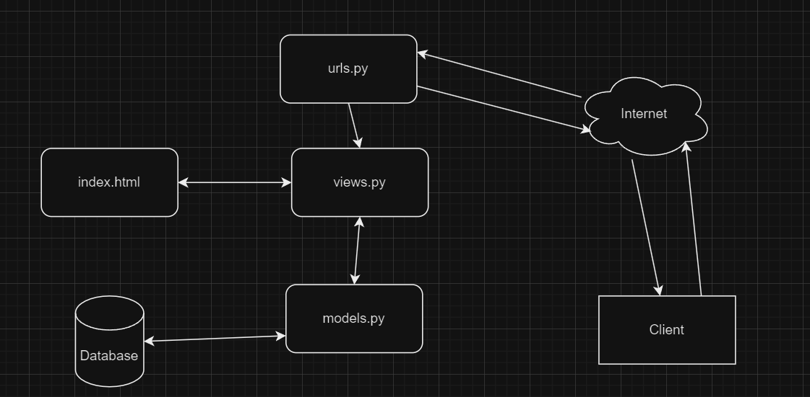

Nama            : Fikri Budianto
Kelas           : PBP F
Link Adaptable  : https://enterkomputerkwsuper.adaptable.app/main/

1. Jelaskan bagaimana cara kamu mengimplementasikan checklist di atas secara step-by-step (bukan hanya sekadar mengikuti tutorial).

Sebelum membuat proyek baru, saya pertama-tama membuat repository git yang nantinya akan diinisialisasi
menggunakan perintah git init dengan menggunakan command prompt. Hal ini saya lakukan agar proyek yang saya kerjakan dapat saya commit dan push ke GitHub sehingga nantinya proyek saya bisa saya deploy. Repository lokal yang terdapat pada komputer saya nantinya akan saya hubungkan dengan repository di GitHub dengan menjalankan perintah:

git branch -M main
git remote add origin https://github.com/budf93/EnterKomputerKWSuper 
git push -u origin main

Setelah menginisialisasi git, saya menginisialisasi projek Django dengan pertama-tama membuat virtual environment dan mengaktifkan virtual environment tersebut. Hal ini dilakukan guna membantu mengisolasi dependencies antara proyek-proyek yang berbeda. Hal itu saya lakukan dengan menjalankan kedua perintah ini

python -m venv env
env\Scripts\activate.bat

Setelah itu, saya menambahkan dependencies yang diperlukan dengan memasukkan dependencies yang dibutuhkan ke dalam requirements.txt lalu saya pasang dependencies tersebut dengan perintah berikut:

pip install -r requirements.txt

Lalu, saya buat proyek EnterKomputerKWSuper dengan perintah berikut.

django-admin startproject EnterKomputerKWSuper .

Lalu, saya menambahkan "*" pada ALLOWED_HOSTS sehingga semua host diizinkan untuk mengakses aplikasi web.

Setelah saya menambahkan "*" pada ALLOWED_HOSTS saya menjalankan aplikasi yang bernama main yang nantinya saya aktifkan dengan menggunakan perintah

python manage.py startapp main

Setelah membuat aplikasi yang bernama main, saya menambahkan aplikasi main ke dalam proyek dengan menambahkan "main" ke dalam list INSTALLED_APPS.

Setelah menambahkan main ke dalam INSTALLED_APPS, saya melakukan routing pada proyek agak dapat menjalankan aplikasi main dengan cara menambahkan urls.py yang bertugas untuk mengatur rute URL yang terkait dengan aplikasi main dengan kode berikut

from django.urls import path
from main.views import show_main

app_name = 'main'

urlpatterns = [
    path('', show_main, name='show_main'),
]

2. Buatlah bagan yang berisi request client ke web aplikasi berbasis Django beserta responnya dan jelaskan pada bagan tersebut kaitan antara urls.py, views.py, models.py, dan berkas html.

3. Jelaskan mengapa kita menggunakan virtual environment? Apakah kita tetap dapat membuat aplikasi web berbasis Django tanpa menggunakan virtual environment?

Kita bisa membuat aplikasi web berbasis Django tanpa menggunakan virtual environment. Namun, pembuat aplikasi web sangat disarankan menggunakan virtual environment karena virtual environment bertugas untuk membantu mengisolasi dependencies antara proyek-proyek yang berbeda sehingga kita tidak perlu khawatir proyek kita akan berinterferensi dengan proyek lain. Selain itu virtual environment juga dapat mencegah masalah-masalah yang disebabkan oleh permasalahan environment seperti aplikasi yang dapat berjalan pada komputer kita tetapi tidak dapat berjalan di komputer orang lain. 

4. Jelaskan apakah itu MVC, MVT, MVVM dan perbedaan dari ketiganya.

MVC adalah sebuah framework dimana sebuah aplikasi dibagi menjadi tiga komponen besar dimana komponen-komponen tersebut mengurus bagian tertentu dari sebuah aplikasi sehingga komponen yang mengurus tampilan aplikasi dan komponen yang mengurus logika dari aplikasi terpisah. MVC terdiri dari tiga komponen, yaitu Model, View, dan Controller. Komponen model mengurusi logika dari aplikasi, komponen view mengurus antarmuka dari aplikasi, dan komponen controller bertugas sebagai perantara dari model dan view.

MVVM terbagi menjadi tiga komponen, yaitu Model, View, dan Viewmodel. Berbeda dengan  merupakan objek yang mengenkapsulasi data dan perilaku dari domain aplikasi, sehingga model di dalam MVVM hanya bertugas untuk menyimpan data. View bertugas untuk mengurus tampilan antarmuka yang dilihat oleh user dan Viewmodel menghubungkan antara model dengan view atau menerima data dari modal dan mengirimkannya ke view untuk ditampilkan. Viewmodel menyimpan logika dari aplikasi.

MVT terbagi menjadi tiga komponen, yaitu Model, View, dan Template. Model di dalam MVT bertugas untuk mengurus basis data dari aplikasi. Berbeda dengan MVC atau MVVC, Template bertugas untuk mengurus tampilan antarmuka seluruhnya dan View digunakan untuk mengeksekusi logika aplikasi dan berinteraksi dengan model untuk membawakan data. 