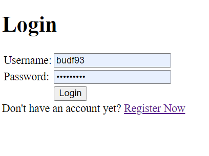
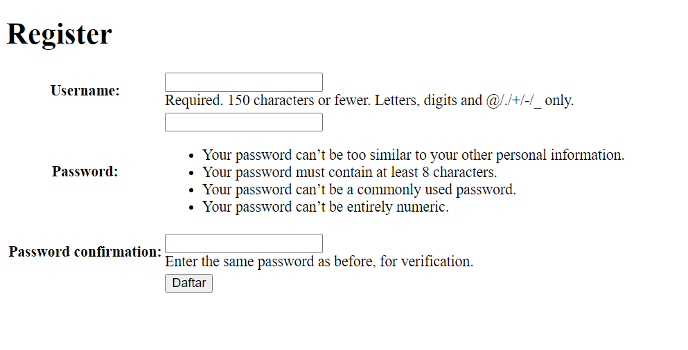
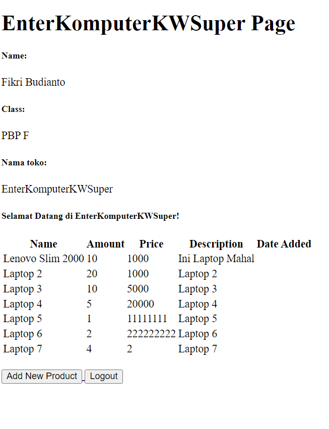
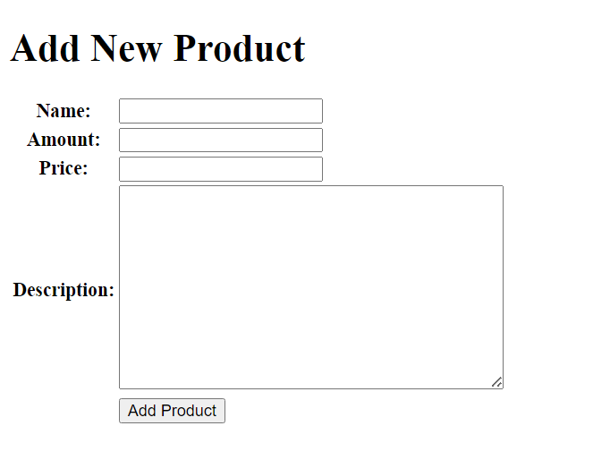

Nama            : Fikri Budianto
Kelas           : PBP F
Link Adaptable  : https://enterkomputerkwsuper.adaptable.app/main/

Checklist untuk tugas ini adalah sebagai berikut:

- Mengimplementasikan fungsi registrasi, login, dan logout untuk memungkinkan pengguna untuk mengakses aplikasi sebelumnya dengan lancar.

- Membuat dua akun pengguna dengan masing-masing tiga dummy data menggunakan model yang telah dibuat pada aplikasi sebelumnya untuk setiap akun di lokal.

- Menghubungkan model Item dengan User.

- Menampilkan detail informasi pengguna yang sedang logged in seperti username dan menerapkan cookies seperti last login pada halaman utama aplikasi.

- Menjawab beberapa pertanyaan berikut pada README.md pada root folder (silakan modifikasi README.md yang telah kamu buat sebelumnya; tambahkan subjudul untuk setiap tugas).

 1. Apa itu Django UserCreationForm, dan jelaskan apa kelebihan dan kekurangannya?
    UserCreationForm adalah sebuah framework autentikasi yang digunakan untuk menghandle pembuatan user baru. UserCreationForm menerima tiga buah input yaitu username, password1 dan password2 yang digunakan untuk konfirmasi password. UserCreationForm memiliki beberapa kelebihan diantaranya memudahkan registrasi user, menjamin keamanan data user, mudah menambahkan field data, dan validasi untuk mencegah pengiriman data yang berbahaya. Kekurangan dari UserCreationForm yaitu sulitnya dalam membuat suatu form yang lebih kompleks.
 
 2. Apa perbedaan antara autentikasi dan otorisasi dalam konteks Django, dan mengapa keduanya penting?
    Di dalam konteks Django, autentikasi berfokus pada memverifikasi identitas seorang pengguna, sedangkan otorisasi berfokus pada tindakan yang seorang pengguna dapat lakukan ketika identitas mereka sudah terkonfirmasi.

 3. Apa itu cookies dalam konteks aplikasi web, dan bagaimana Django menggunakan cookies untuk mengelola data sesi pengguna?
    Cookies merupakan text file berisikan data seperti username dan password yang digunakan untuk mengidentifikasi pengguna tertentu dan meningkatkan pengalaman mereka dalam menggunakan aplikasi web. Django menggunakan cookies untuk mengelola data sesi pengguna dengan cara memberikan suatu session ID unik kepada masing-masing session pengguna dan menyimpan session ID tersebut ke dalam cookie pada device pengguna. Session ID ini merujuk kepada data session pengguna. Ketika pengguna berinteraksi dengan aplikasi web, server menerima session ID dari cookie dan menggunakannya untuk mengakses session data dari session ID tersebut pada server.

 4. Apakah penggunaan cookies aman secara default dalam pengembangan web, atau apakah ada risiko potensial yang harus diwaspadai?
    Penggunaan cookies sendiri merupakan hal yang aman karena data yang disimpan sebagai cookies bukan merupakan data yang berbahaya. Namun, terdapat resiko cookies digunakan oleh orang-orang yang tidak bertanggungjawab untuk menyusup ke dalam akun seorang pengguna dan mencuri data-data yang dimiliki oleh seorang pengguna karena 
    cookies berisikan data-data yang merupakan informasi pribadi dari pengguna.

 5. Jelaskan bagaimana cara kamu mengimplementasikan checklist di atas secara step-by-step (bukan hanya sekadar mengikuti tutorial).
 Melakukan add-commit-push ke GitHub.

 - Mengimplementasikan fungsi registrasi, login, dan logout untuk memungkinkan pengguna untuk mengakses aplikasi sebelumnya dengan lancar.

Untuk fungsi registrasi dilakukan dengan cara pertama-tama mengimpor kode berikut ke dalam views.py pada direktori main 

from django.shortcuts import redirect
from django.contrib.auth.forms import UserCreationForm
from django.contrib import messages  

Lalu, saya menambahkan fungsi yang bernama register yang menerima parameter request yang bertujuan untuk menghasilkan formulir registrasi secara otomatis dan menghasilkan akun pengguna ketika data disubmit dari form. Fungsi register adalah sebagai berikut:

def register(request):
    form = UserCreationForm()

    if request.method == "POST":
        form = UserCreationForm(request.POST)
        if form.is_valid():
            form.save()
            messages.success(request, 'Your account has been successfully created!')
            return redirect('main:login')
    context = {'form':form}
    return render(request, 'register.html', context)

Lalu, saya membuat berkas HTML baru dengan nama register.html pada folder main/templates dengan isi sebagai berikut:




    <title>Register</title>


  

    
    <h1>Register</h1>  

        <form method="POST" >  
              
            <table>  
                {{ form.as_table }}  
                <tr>  
                    <td></td>
                    <td><input type="submit" name="submit" value="Daftar"/></td>  
                </tr>  
            </table>  
        </form>

      
        <ul>   
              
                <li>{{ message }}</li>  
                  
        </ul>   
    

  



Lalu, saya mengimpor fungsi yang telah saya buat dengan cara sebagai berikut:

from main.views import register 

Lalu, saya menambahkan path url ke dalam urlpatterns untuk mengakses fungsi yang sudah diimpor tadi:
...
path('register/', register, name='register'), #sesuaikan dengan nama fungsi yang dibuat
...

Untuk fungsi login, pertama-tama saya mengimport authenticate dan login pada bagian paling atas dengan kode sebagai berikut:

from django.contrib.auth import authenticate, login

Lalu, saya menambahkan fungsi login_user yang bertujuan untuk mengautentikasi pengguna yang ingin login:

def login_user(request):
    if request.method == 'POST':
        username = request.POST.get('username')
        password = request.POST.get('password')
        user = authenticate(request, username=username, password=password)
        if user is not None:
            login(request, user)
            return redirect('main:show_main')
        else:
            messages.info(request, 'Sorry, incorrect username or password. Please try again.')
    context = {}
    return render(request, 'login.html', context)

Lalu, saya membuat berkas HTML baru bernama login.html pada folder main/templates yang berisikan kode sebagai berikut:




    <title>Login</title>




    <h1>Login</h1>

    <form method="POST" action="">
        
        <table>
            <tr>
                <td>Username: </td>
                <td><input type="text" name="username" placeholder="Username" class="form-control"></td>
            </tr>
                    
            <tr>
                <td>Password: </td>
                <td><input type="password" name="password" placeholder="Password" class="form-control"></td>
            </tr>

            <tr>
                <td></td>
                <td><input class="btn login_btn" type="submit" value="Login"></td>
            </tr>
        </table>
    </form>

    
        <ul>
            
                <li>{{ message }}</li>
            
        </ul>
         
        
    Don't have an account yet? <a href="">Register Now</a>



Lalu, pada berkas urls.py saya mengimport fungsi yang baru saya buat lalu saya menambahkan path url yang sesuai ke dalam urlpatterns untuk mengakses fungsi yang sudah diimpor tadi dengan kode sebagai berikut:

Kode untuk mengimpor fungsi yang sudah dibuat:

from main.views import login_user 

Kode untuk menambahkan path url ke urlpatterns:
...
path('login/', login_user, name='login'),
...

Untuk fungsi logout, pertama-tama saya mengimport logout dengan kode sebagai berikut:

from django.contrib.auth.decorators import login_required

Lalu, saya membuat fungsi logout_user yang bertujuan untuk melakukan mekanisme logout. Kodenya adalah sebagai berikut:

def logout_user(request):
    logout(request)
    return redirect('main:login')

Lalu, saya menambahkan kode berikut setelah hyperlink tag untuk Add New Product pada berkas main.html.

<a href="">
    <button>
        Logout
    </button>
</a>  

Lalu, pada file urls.py saha mengimport fungsi yang baru saja saya buat pada views.py dengan kode sebagai berikut:

from main.views import logout_user

Lalu, saya menambahkan path url ke dalam urlpatterns untuk mengakses fungsi logout_user yang baru saja saya buat dengan cara sebagai berikut:

path('logout/', logout_user, name='logout'),

- Membuat dua akun pengguna dengan masing-masing tiga dummy data menggunakan model yang telah dibuat pada aplikasi sebelumnya untuk setiap akun di lokal.

Untuk membuat pengguna, pertama-tama hal yang dilakukan adalah membuat akun dengan memencet tombol Register Now pada login page sebagai berikut: 

Selanjutnya, masukkan username dan password pada kotak yang telah disediakan lalu tekan daftar ketika sudah selesai

Lalu, untuk menambahkan dummy data hal yang dilakukan adalah menekan tombol add new product pada laman berikut:

Setelah itu, masukkan nama, jumlah produk, harga produk, dan deskripsi produk pada kotak yang telah disediakan. Lakukan sampai tiga kali untuk 3 produk yang ingin dibuat.

Setelah menambahkan 3 produk pada satu akun, buat akun baru dengan langkah-langkah diatas dan lakukan hal yang sama pada akun tersebut.

- Menghubungkan model Item dengan User.

Untuk menghubungkan mode Item dengan User, pertama-tama saya mengimpor model pada berkas models.py dengan cara menambahkan kode berikut di bagian paling atas:

from django.contrib.auth.models import User

Lalu, pada model Product yang telah dibuat, saya menambahkan kode berikut untuk menghubungkan satu produk dengan satu user melalui sebuah relationship.

class Product(models.Model):
    user = models.ForeignKey(User, on_delete=models.CASCADE)
    ...

Lalu, pada berkas views.py saya mengubah fungsi create_product menjadi sebagai berikut:

def create_product(request):
    form = ProductForm(request.POST or None)

    if form.is_valid() and request.method == "POST":
        product = form.save(commit=False)
        product.user = request.user
        product.save()
        return HttpResponseRedirect(reverse('main:show_main'))
        ...

Lalu, saya mengubah fungsi show_main menjadi sebagai berikut:

def show_main(request):
    products = Product.objects.filter(user=request.user)

    context = {
        'name': request.user.username,
    ...
...

Setelah semua langkah tersebut dilakukan, dijalankan migrasi dengan cara menjalankan perintah berikut pada command prompt:

python manage.py makemigrations
python manage.py migrate

- Menampilkan detail informasi pengguna yang sedang logged in seperti username dan menerapkan cookies seperti last login pada halaman utama aplikasi.

Pertama-tama, saya membuka views.py lalu mengimpor HttpResponseRedirect, reverse, dan datetime dengan cara sebagai berikut:

import datetime
from django.http import HttpResponseRedirect
from django.urls import reverse

Lalu, pada fungsi login_user saya akan menambahkan fungsi untuk menambahkan cookie yang bernama last_login untuk melihat kapan terakhir kali pengguna melakukan login dengan menggantikan kode yang terdapat pada blok if user is not None menjadi kode berikut:

...
if user is not None:
    login(request, user)
    response = HttpResponseRedirect(reverse("main:show_main")) 
    response.set_cookie('last_login', str(datetime.datetime.now()))
    return response
...

Lalu, pada fungsi show_main saya menambahkan potongan kode 'last_login': request.COOKIES['last_login'], ke dalam variabel context dan mengubah fungsi logout_user menjadi potongan kode berikut:

def logout_user(request):
    logout(request)
    response = HttpResponseRedirect(reverse('main:login'))
    response.delete_cookie('last_login')
    return response

Lalu, pada berkas main.html saya menambahkan potongan kode berikut di antara tabel dan tombol logout untuk menampilkan data last_login

...
<h5>Sesi terakhir login: {{ last_login }}</h5>
...

Ketika kita ingin melihat data cookie last_login, kita dapat menggunakan fitur inspect element pada browser chrome dan membuka bagian Application/Storage. Lalu, klik bagian Cookies dan lihat data cookies yang tersedia. Apabila kita logout dari aplikasi, cookie yang sebelumnya dibuat akan hilang dan dibuat ulang ketika melakukan login ulang.